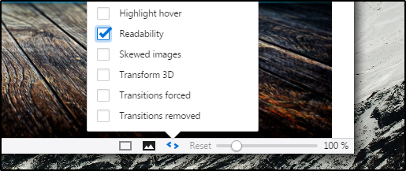

# How to activate Readability mode?

Vivaldi comes together with **Readability Mode** which allows users to read easily web content without seeing any unneccessary content in web page.

When you activate in a tab, you can use it till to disable it.

## How to activate?

* Open a webpage incluiding some text content you wish to read.

* Click **Page Actions** icon on status bar (bottom of window)

* Choose **"Readability"** action

_Note: If you want to disable just click it again._

Reminder: Readability mode is still under developement - 01.09.2016
