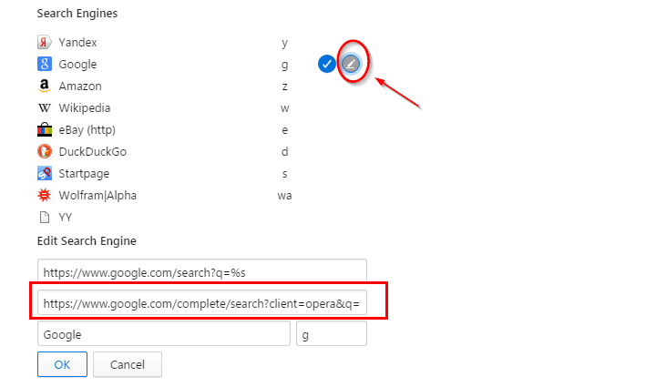
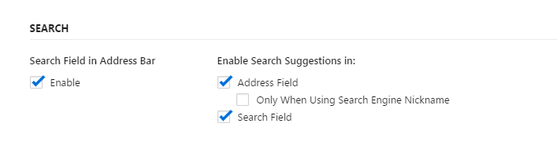
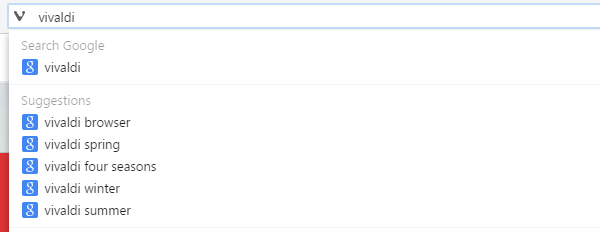

## How to add search suggestions to search engines?

If you want to add search suggestions to your browser URL search field, you can add following settings manually.

* Go to search settings page [vivaldi://settings/search](vivaldi://settings/search)

* Choose a search engine you want and click a pencil icon on right side to edit it.

* Go to edit field (2nd box) on bottom and put the following URL you wish.

* Press Save button.

## Search Engines Suggest URL's

* **Google:** https://www.google.com/complete/search?client=opera&q=%s

* **Youtube:** https://www.google.ru/complete/search?hl=ru&ds=yt&output=firefox&q=%s

* **Yandex:** https://suggest.yandex.ru/suggest-ya.cgi?v=4&part=%s

* **Nigma:** http://cplt2.nigma.ru/complete/query_help.php?suggest=true&q=%s

* **Ru.Wikipedia:** https://ru.wikipedia.org/w/api.php?action=opensearch&search=%s

* **Google Images:** https://www.google.com/complete/search?hl=ru&ds=i&output=firefox&q=%s

* **Яндекс.Маркет:** http://suggest.market.yandex.ru/suggest-market?part=%s

## How to Use

First you should enable **Search Suggestion** on settings.

* Go to search settings page [vivaldi://settings/search](vivaldi://settings/search)

  * Enable Search field in address background
  * Enable search suggestions in

* Go to Address Bar and start to type something. Afterthat you will get some search suggestions as following.

