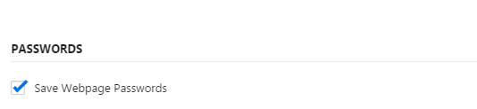

# How to disable password save in webpages?

Vivaldi offers to save passwords in webpages by default and shows you a popup which you can choose Yes or No. But sometimes it can be boring and you can close this notification popup as following.

**Go to Settings / Privacy tab and "Disable Save Passwords"**

