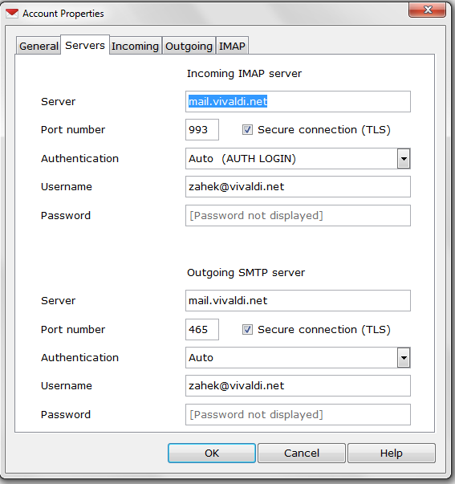

# How do I set up Vivaldi email account in a mail client?

In your desktop or mobile email client create a new IMAP mailbox account using following settings:

## IMAP Server Settings

**Server Type:** IMAP Mail Server

**Server Name:** mail.vivaldi.net

**Port:** 993

### Security Settings

**Connection security:** SSL/TLS

**Authentication method:** Plain password

## SMTP Settings

**Server Name:** mail.vivaldi.net

**Port:** 465

### Security Settings

**Connection security:** SSL/TLS

**Authentication method:** Password

**Username/Password:** same as IMAP settings

--------------------

