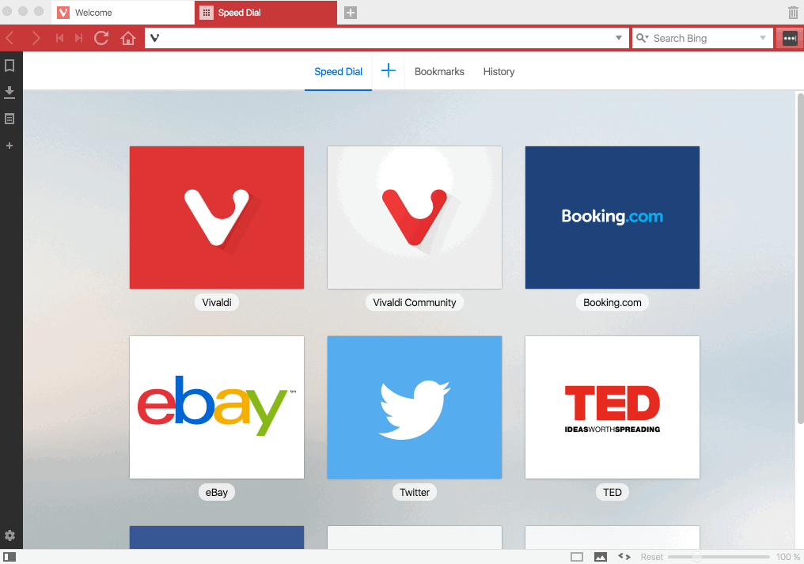

How to install flash player?
============================

Vivaldi browser uses Pepper version of Flash (PPAPI) that Chromium or Chrome uses, if you are noticing “Couldn’t load plugin” or “You need to have the Adobe Flash Player to view this content” messages in these browsers when you tried to view flash-content on web pages, then you have to install Pepper Flash, follow the below instructions to install Flash player in Vivaldi browser.

Installing Flash Player for Vivaldi
-----------------------------------

 * Visit Adobe Flash Player download page
 * Select your Operating System
 * Select Chromium – PPAPI
 * Click download and run the file, after installing the flash player, reopen or restart the browser.

### Tips :)

Check Flash plugin shows PPAPI setting after install by visiting [vivaldi://plugins](vivaldi://plugins)

